# EDA Analysis — Pharma Manufacturing Data (2025)

This document consolidates all exploratory data analysis performed across 7 modules covering production volume, product performance, machine utilization, lead time, yield, material loss, and market demand. Each section presents the analytical question, the visualization, and a full breakdown of observations, insights, and recommendations.

## Background

This project was built as part of a career transition from pharmaceutical manufacturing (Senior Process Lead) into data analytics. The domain knowledge behind the analytical decisions — yield targets, GMP data handling, stage-level process flow — comes directly from working in a regulated solid dosage manufacturing environment.

The analysis is meant to answer questions that matter to plant operations: where are we losing yield, which machines are carrying the most load, and how does production volume shift across the year.

An end-to-end data analytics project built on real batch manufacturing data from a solid dosage form pharmaceutical facility. This covers the full pipeline — from raw Excel records to a structured PostgreSQL database and a 7-module exploratory data analysis portfolio.

The goal of this project is to show how manufacturing data can be turned into useful insights for production planning, yield monitoring, and machine performance tracking.

> **Note on data privacy:** Product names and job order numbers have been anonymized. Generic drug names (INN) are used throughout in place of proprietary brand names. Raw source data is excluded from this repository.

---

## What's in this repo

```
Pharma_Manufacturing_Data_Analysis_Project/
├── PYTHON_ETL_PIPELINE/        # Data pipeline — Extract, Transform, Load
├── SQL_STAR_SCHEMA_DATABASE/   # PostgreSQL star schema design
├── EDA_ANALYSIS/               # 7-module exploratory data analysis notebooks
└── README.md
```

---

## Project Breakdown

### Python ETL Pipeline
A Python pipeline that reads raw Excel batch records, cleans and transforms the data, and loads it into a PostgreSQL star schema. Handles real-world data quality issues like inconsistent casing, messy yield values, missing remarks, and semantic duplicates in drug names.

**Key features:** upsert-safe loaders, three-tier yield imputation, GMP-aligned data flagging, atomic transactions, idempotent pipeline design.

See the [ETL README](./PYTHON_ETL_PIPELINE/readme.md) for full details.

---

### SQL Star Schema Database
A PostgreSQL star schema designed for stage-level manufacturing analysis. One row per stage per batch in the fact table — this makes yield and machine queries much cleaner compared to the original flat Excel structure.

**Tables:** `fact_batch_production`, `dim_product`, `dim_machine`, `dim_date`, `dim_job_order`, `dim_stage_target`

See the [Schema README](./SQL_STAR_SCHEMA_DATABASE/readme.md) for full details.

---

### EDA Analysis ✅
Seven-module exploratory data analysis built entirely in Python (pandas + Plotly) with SQL queries against the PostgreSQL star schema. Every analytical finding is structured as Observation → Insight → Recommendation, written at plant manager / operations head level.

| Module | Topic | Status |
|---|---|---|
| 1 | Production Volume Analysis | ✅ Complete |
| 2 | Product Analysis | ✅ Complete |
| 3 | Machine Utilization Analysis | ✅ Complete |
| 4 | Lead Time Analysis | ✅ Complete |
| 5 | Yield Analysis | ✅ Complete |
| 6 | Loss Analysis | ✅ Complete |
| 7 | Market Demand Inference | ✅ Complete |

See the [EDA README](./EDA_ANALYSIS/README.md) for full analysis details, key findings, and stakeholder recommendations.

---

## Dataset Overview

| Item | Detail |
|---|---|
| Source | Flat Excel batch manufacturing records |
| Records | 1,064 batches |
| Dosage forms | 8 types (film-coated tablet, capsule, SR tablet, tablet, bilayer tablet, extended release, enteric-coated, modified release) |
| Stages tracked | Wet Granulation, Dry Blending, Compression, Encapsulation, Coating |
| Date range | 2025 |
| Fact table rows | 5,320 (one row per stage per batch) |

---

## Table of Contents

- [Module 1 — Production Volume Overview](#module-1--production-volume-overview)
- [Module 2 — Product-Level Performance](#module-2--product-level-performance)
- [Module 3 — Machine Utilization & Yield](#module-3--machine-utilization--yield)
- [Module 4 — Lead Time Analysis](#module-4--lead-time-analysis)
- [Module 5 — Yield Analysis](#module-5--yield-analysis)
- [Module 6 — Material Loss Analysis](#module-6--material-loss-analysis)
- [Module 7 — Market Demand Inference](#module-7--market-demand-inference)
- [Cross-Module Summary](#cross-module-summary)

---

## Module 1 — Production Volume Overview

### Q1: What is the number of job orders processed per month?

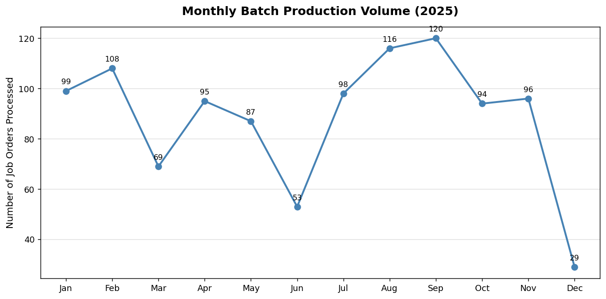

**Observation:** Production peaked in August (116 batches) and September (120 batches), while June registered the lowest mid-year volume at just 53 batches. February was the highest output month in the first half at 108 batches. December dropped sharply to 29, signaling a year-end wind-down.

**Insight:** Production peaks in Q3 (August–September), coinciding with the rainy season when demand for cold, cough, and vitamin products typically increases. The June dip reflects a planned 3-week operational downtime for audit preparation.

**Recommendation:** Schedule maintenance, machine calibration, and employee training to complete by end of July to ensure full capacity during the Q3 demand surge. If an audit is anticipated in mid-2026, preparation activities should begin no later than April to avoid compressing the pre-audit shutdown into June.

---

### Q2: What is the total units produced per quarter in 2025?

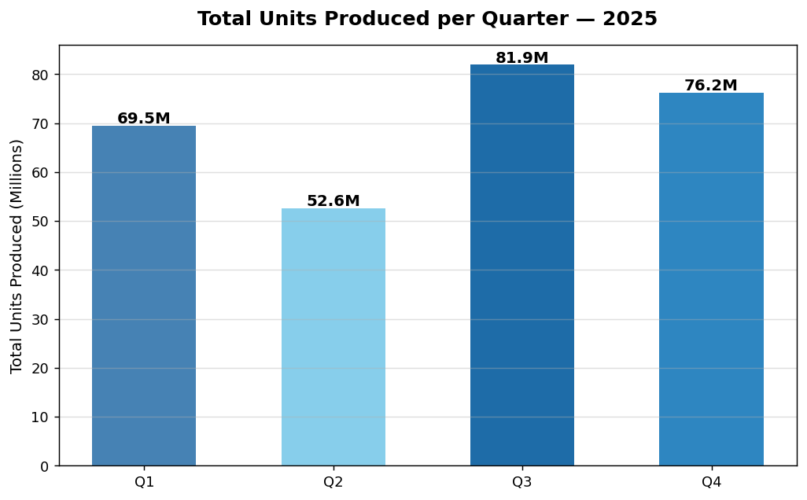

**Observation:** Q3 achieved the highest output at 81.9M units, followed by Q4 (76.2M), Q1 (69.5M), and Q2 (52.6M) — the lowest quarter.

**Insight:** Large volume is concentrated in the last two quarters of the year. Q3 gets the highest output (81.9M), driven by high job order demand. Q2 gets the lowest output due to fewer batches caused by audit preparation and the Holy Week operational shutdown.

**Recommendation:** Pre-build inventory in Q1 to buffer Q2 downtime. Schedule overtime in March and early April before Holy Week to absorb the production gap and avoid delivery shortfalls to customers who depend on Q2 shipments.

---

### Q3: What is the total units produced by dosage form?

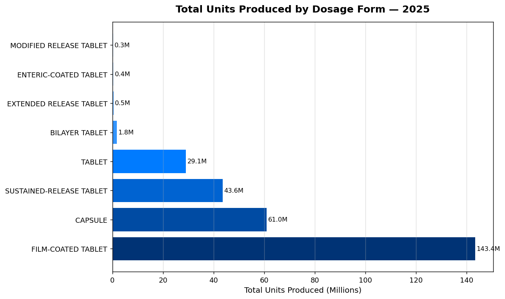

**Observation:** Film-Coated Tablet dominates at 143.4M units (51.2% of total output), followed by Capsule (61.0M, 21.8%) and Sustained-Release Tablet (43.6M, 15.7%). These three dosage forms together account for 88.7% of all units produced. Bilayer Tablet, Extended Release, Enteric-Coated, and Modified Release Tablets collectively account for less than 1% of total output.

**Insight:** The facility's core competency is in coating technology, as film-coated tablets represent over half of all output. The long tail of low-volume dosage forms (bilayer, EC, ER, MR) likely reflects specialty or niche products that require different equipment setups.

**Recommendations:**
1. Prioritize coating process improvements (cycle time, yield, solution utilization) — they impact the majority of output.
2. During low capsule order periods, consider reallocating encapsulation machine time for cleaning, qualification, or operator training.
3. Evaluate whether the four low-volume dosage forms are strategically important enough to justify their dedicated equipment and line setup costs.

---

## Module 2 — Product-Level Performance

### Q1: What are the top 10 generics by total batch output?

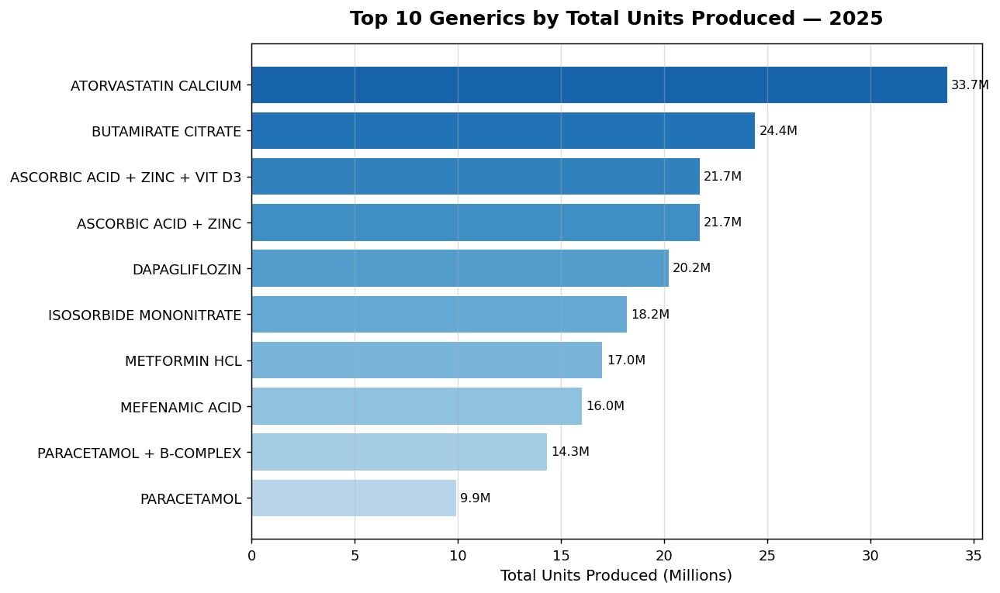

**Observation:** Atorvastatin Calcium leads at 33.7M units, followed by Butamirate Citrate (24.4M), Ascorbic Acid + Zinc + Vitamin D3 (21.7M), and Ascorbic Acid + Zinc (21.7M). Dapagliflozin (20.2M), Isosorbide Mononitrate (18.2M), Metformin HCL (17.0M), and Mefenamic Acid (16.0M) round out the top eight.

**Insight:** Atorvastatin Calcium's dominant volume reflects chronic cardiovascular therapy demand, driving stable year-round manufacturing schedules. The presence of two Ascorbic Acid + Zinc variants with nearly identical output (21.7M each) suggests a product naming inconsistency that may complicate reporting and scheduling downstream.

**Recommendation:** Flag Atorvastatin as a core utilization driver for the tablet line. Standardize the naming convention between the two Ascorbic Acid + Zinc variants to prevent double-counting in reports. Investigate whether they represent genuinely different formulations or the same product under different record entries.

---

### Q2: Which generics have the most batches produced?

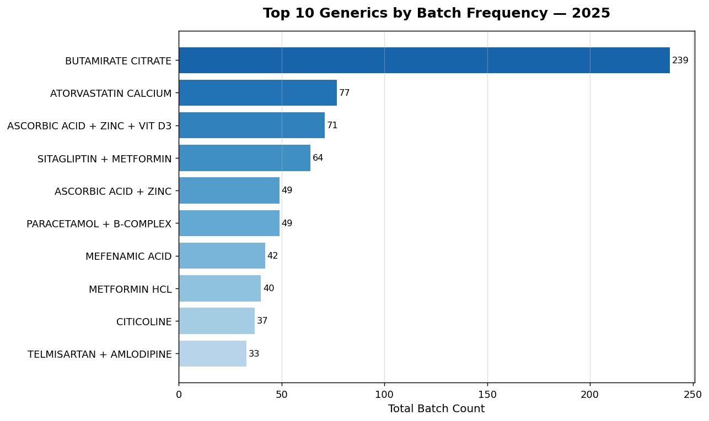

**Observation:** Butamirate Citrate leads batch frequency with 239 batches in 2025 — more than triple the next highest generic (Atorvastatin Calcium at 77 batches). Ascorbic Acid + Zinc + Vitamin D3 (71), Sitagliptin + Metformin (64), and Ascorbic Acid + Zinc (49) follow.

**Insight:** Butamirate Citrate's 239-batch count combined with its 24.4M unit output implies relatively small individual batch sizes — consistent with an OTC cough product that requires frequent, smaller production runs to match fluctuating retail demand. In contrast, Atorvastatin Calcium achieves 33.7M units from just 77 batches, indicating much larger batch sizes per run.

**Recommendation:** Ensure machine availability and granule inventory for compounding and downstream stages for Butamirate Citrate to avoid production bottlenecks. Given its high frequency, even a 1-day average delay per batch translates to over 7 months of cumulative lost production time annually.

---

### Q3: Which products are consistently underperforming the 96% yield threshold?

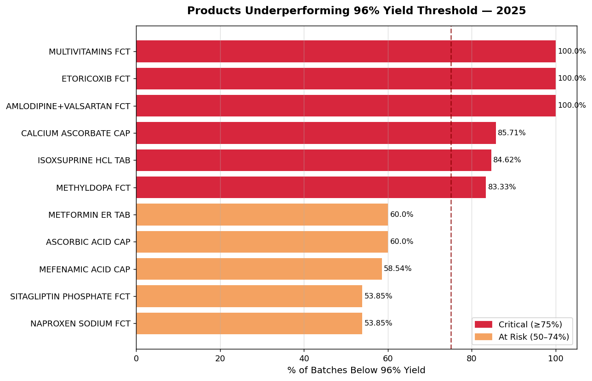

**Observation:** Three products (Multivitamins FCT, Etoricoxib FCT, Amlodipine Besilate + Valsartan FCT) failed the 96% yield threshold in 100% of their batches — all flagged as Critical. Calcium Ascorbate Capsule, Isoxsuprine HCL Tablet, and Methyldopa FCT also exceeded the Critical threshold (≥75% of batches below target). Mefenamic Acid Capsule (58.54%), Ascorbic Acid Capsule (60%), and Metformin ER Tablet (60%) are flagged as At Risk.

**Insight:** The Critical products represent a systemic formulation or process issue rather than random variation. Products at 100% failure rate suggest that the current process parameters, tooling, or coating solution for these specific generics are fundamentally misaligned with the yield target.

**Recommendations:**
1. Initiate a process review for all Critical products, examining coating pan loading, solution spray rate, inlet/outlet temperature, and tablet core hardness.
2. For Mefenamic Acid Capsule specifically (41 batches, 58.54% failure rate), the large sample size makes this statistically unambiguous — escalate to a formal CAPA.
3. Set a quarterly review cycle for all At Risk products to track whether yield improves or deteriorates.

---

## Module 3 — Machine Utilization & Yield

### Batch Count per Machine — Wet Granulation

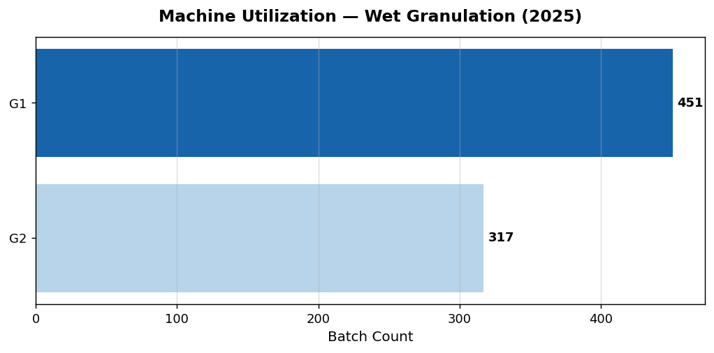

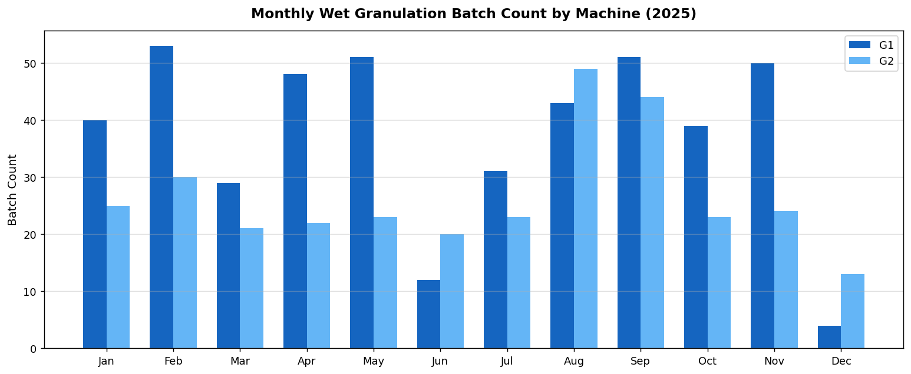

**Observation:** G1 handled 451 batches while G2 handled 317, totaling 768 wet granulation batches out of 1,064 total batches — meaning 296 batches skipped wet granulation entirely (dry blend products). Monthly data shows G1 consistently outpacing G2, except in August (G2: 49, G1: 43) and September (G2: 44, G1: 51) when the gap narrowed significantly.

**Insight:** G1 carries a significantly heavier load than G2, at roughly a 59/41 split. The August–September equalization coincides with the Q3 production peak, suggesting G2 is brought to full utilization only when volume demands it.

**Recommendation:** Investigate whether G2 is being underutilized due to scheduling preference or actual capacity constraints. Rebalancing granulator assignments could reduce wear concentration on G1 and extend its preventive maintenance intervals.

---

### Batch Count per Machine — Dry Blending

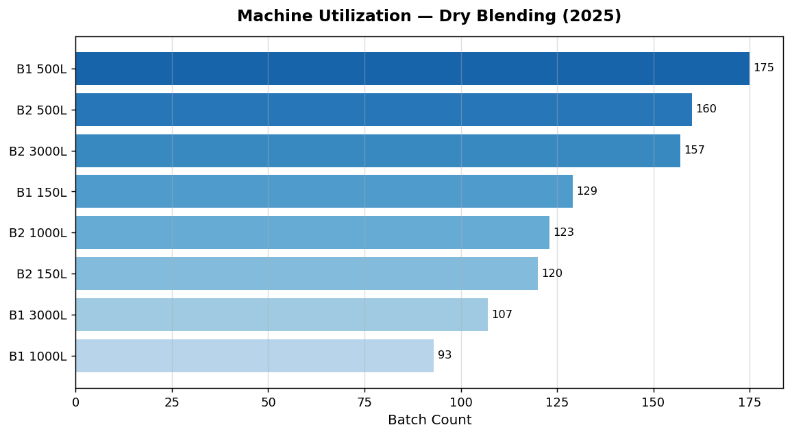

**Observation:** B1 500L leads at 175 batches, followed closely by B2 500L (160) and B2 3000L (157). B1 150L (129) and B2 1000L (123) are mid-range. B2 150L (120), B1 3000L (107), and B1 1000L (93) trail.

**Insight:** The 500L blenders are the workhorses of the blending operation, reflecting that most products have batch sizes suited to smaller blender volumes. The large-volume blenders (B1 3000L, B2 3000L) are used selectively, likely for high-volume generics like Butamirate Citrate.

**Recommendation:** Monitor B1 1000L utilization — at only 93 batches it may be underutilized relative to its capacity. Cross-reference the batch size distribution against blender capacity to determine if there is a scheduling opportunity to shift products from the overloaded 500L blenders.

---

### Batch Count per Machine — Compression

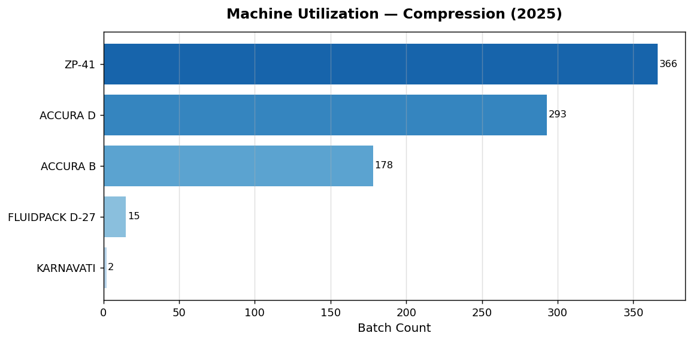

**Observation:** ZP-41 dominates at 366 batches, followed by ACCURA D (293) and ACCURA B (178). FLUIDPACK D-27 handled only 15 batches and KARNAVATI just 2.

**Insight:** Three machines handle virtually all compression volume. FLUIDPACK D-27 and KARNAVATI appear to be either backup machines, specialized equipment for specific formulations, or machines that experienced significant downtime during 2025.

**Recommendation:** Verify whether FLUIDPACK D-27 and KARNAVATI are still active assets or candidates for decommissioning. Underutilized capital equipment represents idle depreciation cost without productivity return.

---

### Batch Count per Machine — Coating

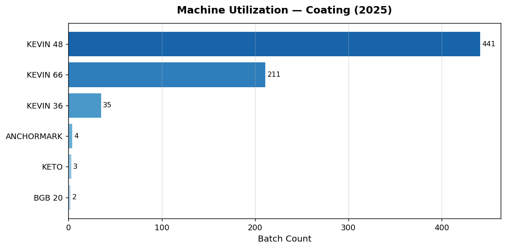

**Observation:** KEVIN 48 handled 441 batches — more than double KEVIN 66's 211. KEVIN 36 (35), ANCHORMARK (4), KETO (3), and BGB 20 (2) are minimally used.

**Insight:** KEVIN 48 alone handles 63% of all coating batches, making it a single point of failure risk for the coating operation. Any unplanned downtime on KEVIN 48 would immediately impact more than half of all coating throughput.

**Recommendation:** Establish a KEVIN 48 risk mitigation plan: accelerate its preventive maintenance schedule, pre-qualify KEVIN 66 for all KEVIN 48-compatible products, and verify the operational readiness of the underutilized coaters as emergency backup capacity.

---

### Batch Count per Machine — Encapsulation

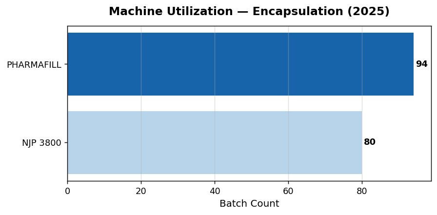

**Observation:** PHARMAFILL handled 94 batches and NJP 3800 handled 80, for a total of 174 encapsulation batches — a relatively balanced 54/46 split.

**Insight:** The encapsulation line has the healthiest utilization balance across all production stages. Neither machine is overburdened and both are actively contributing.

**Recommendation:** Maintain the current scheduling approach. As capsule demand grows (signaled by its Q3 surge in Module 7), this stage has the most straightforward path to scaling — simply increase batch assignments to both machines proportionally.

---

### Average Yield by Machine — Compression (Target: 97%)

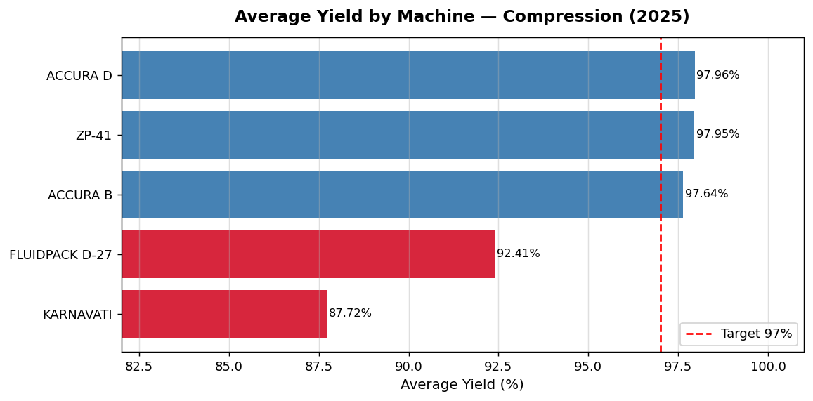

**Observation:** ACCURA D (97.96%) and ZP-41 (97.95%) both meet the 97% target comfortably. ACCURA B (97.64%) is marginally above target. FLUIDPACK D-27 drops sharply to 92.41% and KARNAVATI is the worst performer at 87.72% — both well below the 97% target.

**Insight:** The three high-volume machines all perform at or above target, which is reassuring given they handle the bulk of compression batches. However, FLUIDPACK D-27 and KARNAVATI's yield deficits are significant — 4.59 and 9.28 percentage points below target respectively.

**Recommendation:** Before decommissioning FLUIDPACK D-27 or KARNAVATI, run a controlled trial batch on each to separate equipment condition from product-mix effects. If yield remains low under controlled conditions, prioritize refurbishment or decommissioning.

---

### Machine Frequency vs Yield — Compression

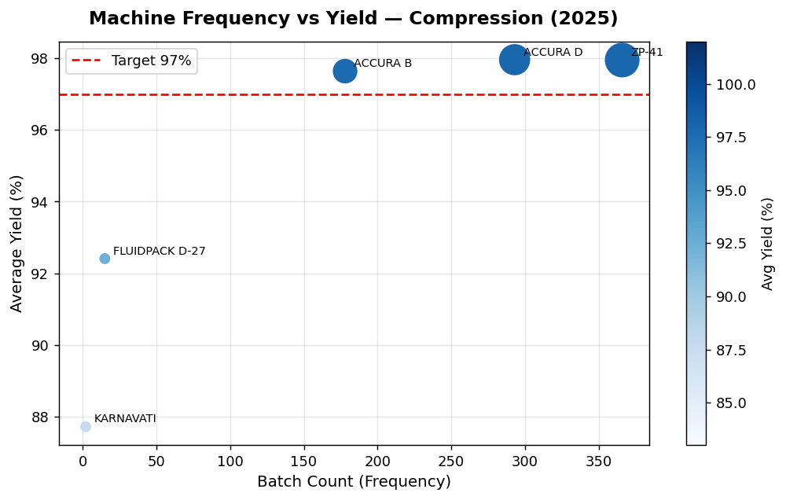

**Observation:** The three high-frequency machines cluster tightly above the 97% target line. The two low-frequency machines sit far below: FLUIDPACK D-27 at 15 batches and 92.41%, and KARNAVATI at just 2 batches and 87.72%.

**Insight:** There is a strong positive relationship between machine frequency and yield in compression. The causal direction is ambiguous — high-usage machines may yield better because operators are more practiced on them, OR machines that yield poorly are naturally scheduled less.

**Recommendation:** Run controlled comparative trials on low-frequency machines before any decommissioning decision to establish whether the low yield is causal or correlational.

---

### Average Yield by Machine — Coating (Target: 96%)

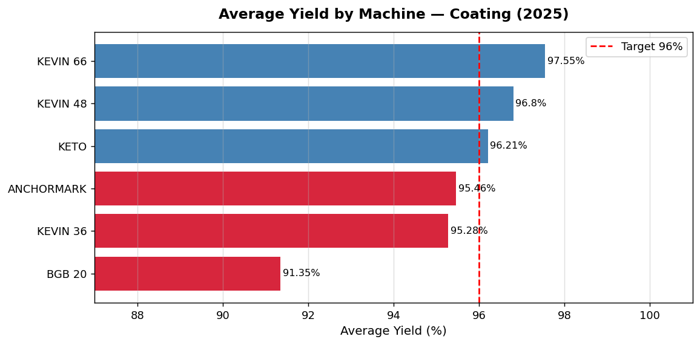

**Observation:** KEVIN 66 leads at 97.55% and KEVIN 48 at 96.8% — both meeting the 96% target. KETO (96.21%) barely meets target. ANCHORMARK (95.46%) and KEVIN 36 (95.28%) fall below target. BGB 20 is the worst at 91.35%.

**Insight:** The two machines carrying the highest workload are both above target. The underperforming machines all have very low batch counts (4, 35, and 2 respectively), raising sample-size caution — except KEVIN 36 at 35 batches, which has enough observations to treat the result as a meaningful signal.

**Recommendation:** Investigate KEVIN 36 (35 batches, 95.28%). Its below-target yield may reflect a genuine process issue. Check coating solution concentration, pan loading practice, and spray nozzle condition.

---

### Machine Frequency vs Yield — Coating

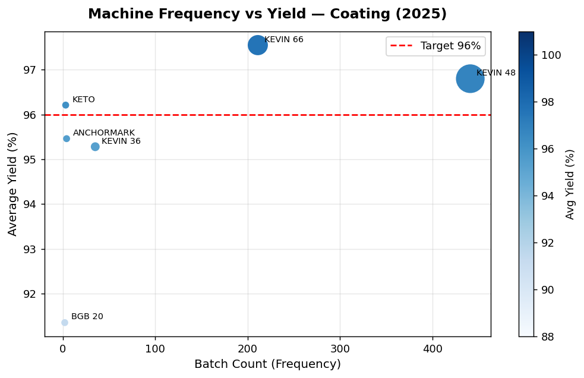

**Observation:** The same positive frequency-yield pattern observed in compression holds in coating. KEVIN 48 and KEVIN 66 sit above the 96% target. Low-usage machines cluster at the left edge of the scatter below target, with BGB 20 as the outlier at 91.35%.

**Insight:** Consistent machine use and operator familiarity correlate with meeting yield targets. Infrequently used machines — regardless of their maintenance status — consistently underperform.

---

### Average Yield by Machine — Encapsulation (Target: 97%)

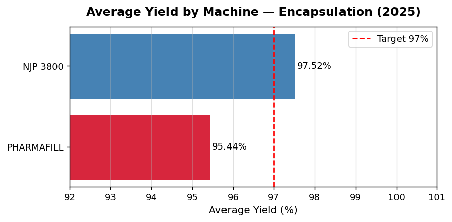

**Observation:** NJP 3800 meets the 97% target at 97.52%. PHARMAFILL falls below at 95.44% — a 1.56 percentage point gap across 94 batches.

**Insight:** Unlike the low-count outliers in compression and coating, PHARMAFILL's underperformance is statistically meaningful — 94 batches is a large enough sample to treat this as a real signal. A 95.44% average means roughly 1 in 22 batches on PHARMAFILL loses material above the acceptable threshold.

**Recommendation:** Initiate a formal investigation on PHARMAFILL: review capsule fill weight variation, machine speed settings, and tooling wear history. Improving its yield by even 1 percentage point would recover approximately 15,000–20,000 units per batch.

---

### Machine Frequency vs Yield — Encapsulation

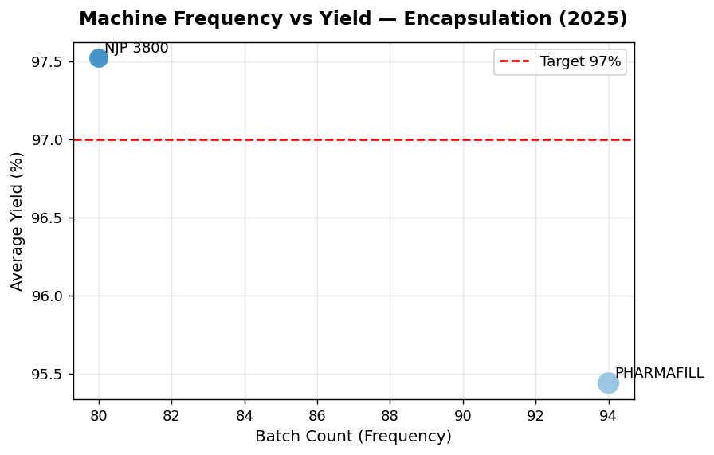

**Observation:** This is the only stage where the frequency-yield relationship is inverted. NJP 3800, the lower-frequency machine at 80 batches, sits above the 97% target at 97.52%. PHARMAFILL, the higher-frequency machine at 94 batches, sits below target at 95.44%.

**Insight:** Unlike compression and coating, encapsulation shows a negative frequency-yield relationship. The machine used more frequently is the one underperforming. This rules out "low usage = lack of practice" as the explanation and points instead to machine condition.

**Recommendation:** Cross-examine PHARMAFILL's maintenance history against its yield trend. If yield degraded over time rather than being consistently below target, it points to progressive mechanical wear as the root cause.

---

## Module 4 — Lead Time Analysis

### Q1: What is the average lead time per dosage form?

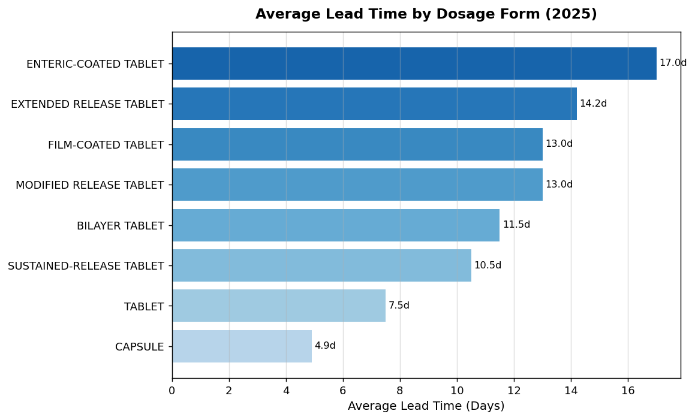

**Observation:** Enteric-Coated Tablet has the longest average lead time at 17 days, followed by Extended Release Tablet (14.2 days), Film-Coated Tablet and Modified Release Tablet (both 13 days), Bilayer Tablet (11.5 days), and Sustained-Release Tablet (10.5 days). Plain Tablet (7.5 days) and Capsule (4.9 days) are the fastest to complete.

**Insight:** The ranking follows a clear manufacturing logic — dosage forms requiring more processing stages naturally take longer. Capsules are fastest because they skip compression and coating entirely. Enteric-Coated Tablets take longest because they require both compression and a pH-sensitive coating that demands longer process validation per batch.

**Recommendation:** For Film-Coated Tablets — the highest-volume dosage form at 51.2% of output — the 13-day average is acceptable, but any reduction through process optimization (e.g., faster coating cycle, reduced inter-stage waiting) would have outsized impact on overall facility throughput and on-time delivery performance.

---

### Q2: What is the average lead time per month?

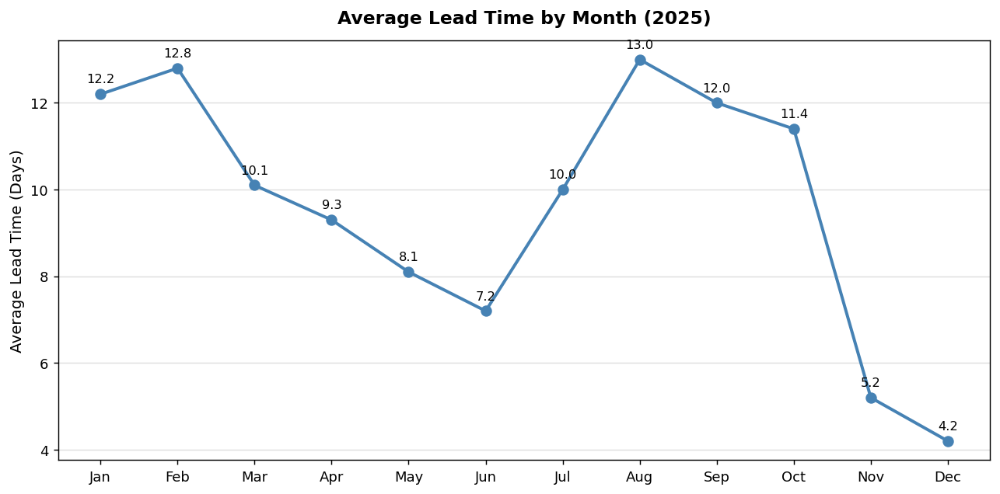

**Observation:** Lead times peak in February (12.8 days) and August (13 days), then decline steadily through the second half of the year — dropping sharply from October (11.4 days) to November (5.2 days) and hitting the annual low in December (4.2 days). June is the mid-year low at 7.2 days before climbing again in July and August.

**Insight:** The two peaks — February and August — align with high production volume months (108 and 116 batches respectively). When the facility is processing more batches concurrently, scheduling queues form and inter-stage waiting time increases, extending overall lead time.

**Recommendation:** Introduce a batch-level queueing model to forecast lead time inflation during high-volume months. In August specifically, proactively communicate extended lead times to supply chain and commercial teams 4–6 weeks in advance to avoid customer impact.

---

### Q3: Which generics have the longest average lead time?

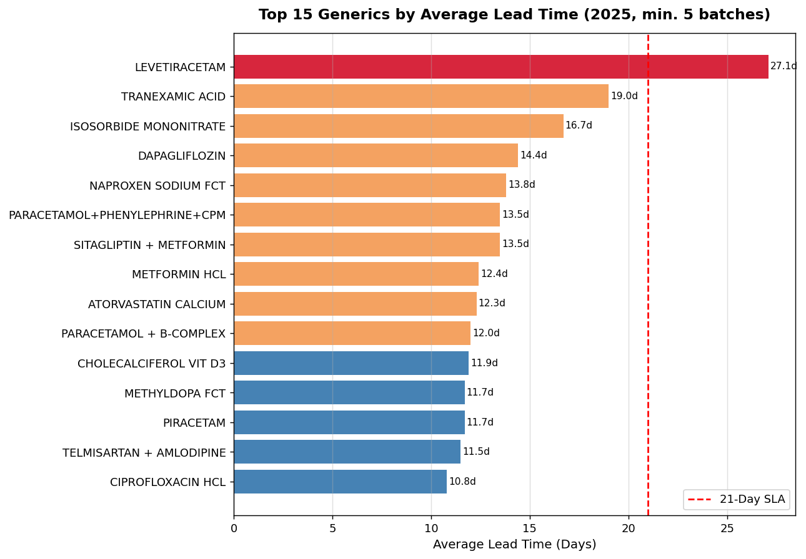

**Observation:** Levetiracetam leads significantly at 27.1 days — the only generic exceeding the 21-day SLA by a meaningful margin. Tranexamic Acid follows at 19 days and Isosorbide Mononitrate at 16.7 days. The remaining 12 generics range from 10.8 to 14.4 days. All entries required a minimum of 5 batches.

**Insight:** Levetiracetam's 27.1-day average is 8 days above the 21-day SLA and nearly 8 days longer than the second-longest generic. Extended release formulations with strict dissolution specifications (common for anticonvulsants) often require additional in-process testing hold times not counted as machine time.

**Recommendation:** Conduct a lead time breakdown for Levetiracetam — identify whether the excess time is in machine processing, QC hold, or inter-stage waiting. If it is QC hold time, explore whether a rapid dissolution testing protocol can compress the hold window without compromising quality assurance.

---

### Q4: What proportion of batches meet the 21-day lead time target by dosage form?

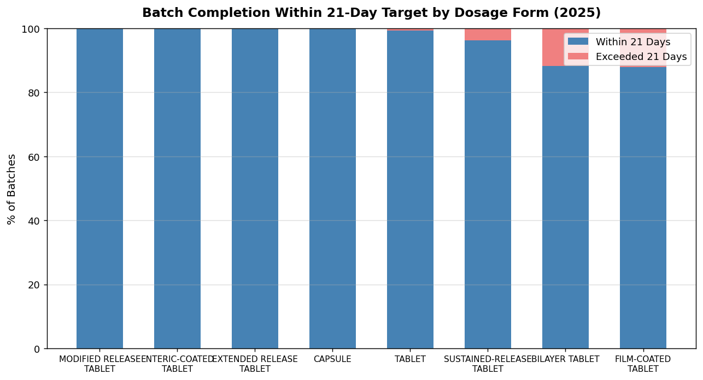

**Observation:** Capsule (100%), Tablet (99.3%), Extended Release Tablet (100%), Enteric-Coated Tablet (100%), and Modified Release Tablet (100%) all meet the 21-day SLA perfectly or near-perfectly. Sustained-Release Tablet achieves 96.2%. Film-Coated Tablet sits at 87.9% (12.1% exceeded) and Bilayer Tablet at 88.2% (11.8% exceeded).

**Insight:** The 100% SLA compliance for Enteric-Coated and Extended Release Tablets is notable — despite having the longest average lead times, they still fall within the 21-day window. The issue is specifically Film-Coated and Bilayer Tablet batches experiencing delays on top of already-longer processes.

**Recommendation:** Film-Coated Tablet's 12.1% SLA breach rate across 422 batches translates to approximately 51 late batches per year. Investigate whether these breaches are concentrated in specific months (Q3 congestion), on specific machines (KEVIN 48 load), or on specific generics (e.g., the yield underperformers from Module 2).

---

## Module 5 — Yield Analysis

### Q1: What is the average yield per stage across all batches?

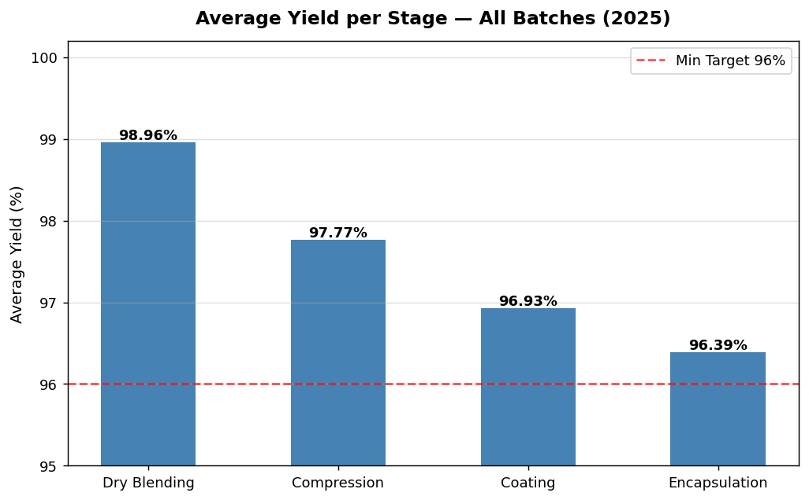

**Observation:** Dry Blending leads at 98.96%, followed by Compression (97.77%) and Coating (96.93%). Encapsulation is the lowest-performing stage at 96.39% — the only stage that sits closest to the minimum target threshold.

**Insight:** All four stages are above the minimum 96% target at the aggregate level, meaning the facility is technically compliant. However, the spread between Dry Blending (98.96%) and Encapsulation (96.39%) is 2.57 percentage points — a significant gap when translated into absolute units across 1,064 batches.

**Recommendation:** Do not rely on aggregate yield as the sole quality metric. Stage-level averages mask batch-level variance, especially for Encapsulation, which sits just 0.39 percentage points above the minimum target. The batch-level distribution (Q4 below) reveals a far more critical picture.

---

### Q2: What is the average yield per dosage form per stage?

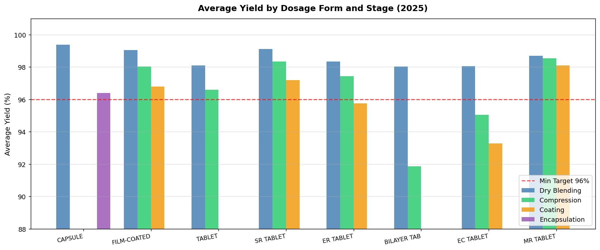

**Observation:** Bilayer Tablet in the coating stage is the worst combination at 91.85% — 4.15 points below the 96% minimum target. Enteric-Coated Tablet coating (93.28%) and compression (95.05%) are both below target. Extended Release Tablet coating sits at 95.75%. All dry blending yields are strong across all dosage forms, ranging from 98.03% to 99.39%.

**Insight:** The coating stage is the most problematic across dosage forms — specifically for Bilayer Tablet and Enteric-Coated Tablet, both of which involve complex coating chemistry (dual-layer and pH-sensitive coating, respectively). Dry Blending is universally strong, confirming that upstream processes are not the source of quality issues.

**Recommendations:**
1. For Bilayer Tablet (91.85% coating yield): review inter-layer adhesion process, tablet friability before coating, and coating pan parameters.
2. For Enteric-Coated Tablet (93.28% coating yield): examine the Eudragit coating solution concentration, application rate, and curing parameters.
3. Prioritize these two dosage forms for process optimization before expanding their production volumes.

---

### Q3: How does yield trend monthly across stages?

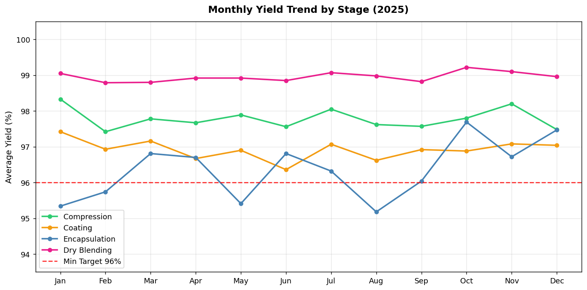

**Observation:** Dry Blending is the most stable line throughout the year, consistently between 98.5% and 99.2%. Compression is similarly stable (97.5%–98.3%). Coating shows moderate variability, dipping to its lowest in June at 96.36% before recovering. Encapsulation is the most volatile stage — dropping below the 96% target in January (95.34%), May (95.41%), and August (95.18%), with its lowest point in August.

**Insight:** Encapsulation is the only stage that repeatedly breaches the 96% minimum target floor. The January, May, and August dips suggest a pattern that may be linked to environmental conditions (humidity affecting capsule shell hardness), operator scheduling, or preventive maintenance timing.

**Recommendation:** Cross-correlate the encapsulation yield dips with environmental data (relative humidity in the encapsulation room), operator staffing records, and machine maintenance logs for January, May, and August. If humidity is a factor, consider installing or improving HVAC dehumidification in the encapsulation area.

---

### Q4: What percentage of batches fall below the yield target per stage?

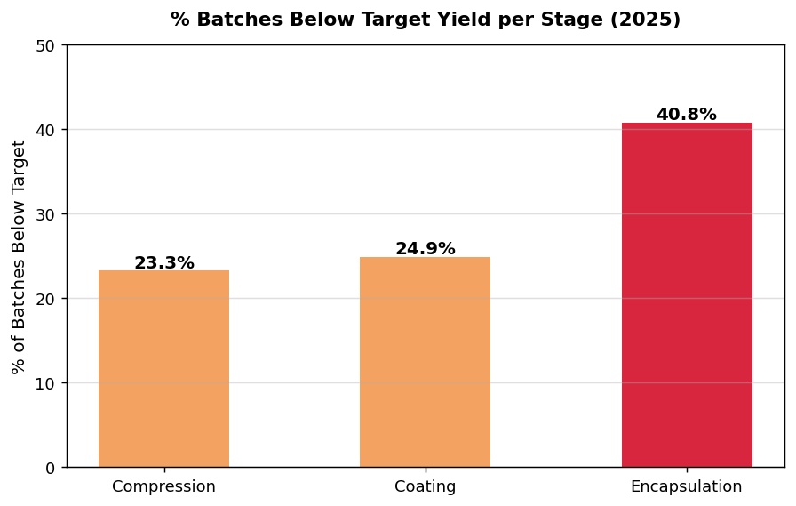

**Observation:** Encapsulation has the highest proportion of below-target batches at 40.8% — meaning 4 in every 10 encapsulation batches fails to meet the 97% target. Coating follows at 24.9% and Compression at 23.3%.

**Insight:** A 40.8% below-target rate for encapsulation is a critical finding. The aggregate yield of 96.39% looks acceptable on the surface — but the batch-level distribution reveals that nearly half of all encapsulation batches are individually deficient. A small number of high-yield batches are masking the systematic underperformance of a much larger proportion.

**Recommendation:** Shift the KPI reporting framework for encapsulation from average yield to "% of batches meeting target." A target of reducing the below-threshold rate from 40.8% to below 20% within two quarters would provide a more meaningful operational goal than improving the average yield by fractions of a percent.

---

## Module 6 — Material Loss Analysis

### Q1: What is the total material loss per stage in units?

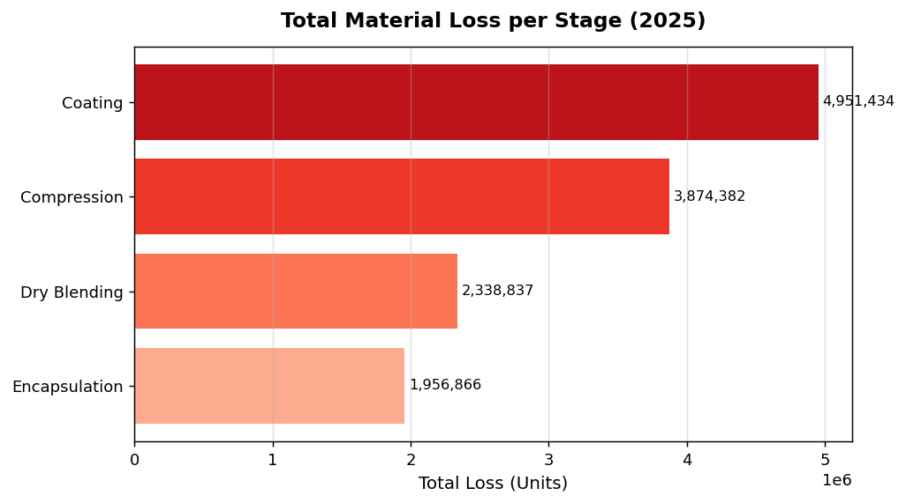

**Observation:** Coating generates the highest absolute material loss at 4,951,434 units, followed by Compression at 3,874,382 units. Dry Blending accounts for 2,338,837 units and Encapsulation for 1,956,866 units. Total facility-wide material loss is approximately 13.1 million units in 2025.

**Insight:** Coating's position as the top loss stage is counterintuitive given that its average yield (96.93%) is higher than Encapsulation (96.39%). The explanation lies in volume — coating processes the largest number of applicable batches and at the highest absolute unit counts. This reinforces that loss optimization should consider both yield rate and throughput volume, not yield rate alone.

**Recommendation:** For coating, focus on reducing loss through solution utilization efficiency (tablet coating pan loading optimization, spray rate calibration). Even a 0.5% yield improvement on 696 coating batches would recover approximately 1.5–2M units annually.

---

### Q2: What is the total material loss by dosage form?

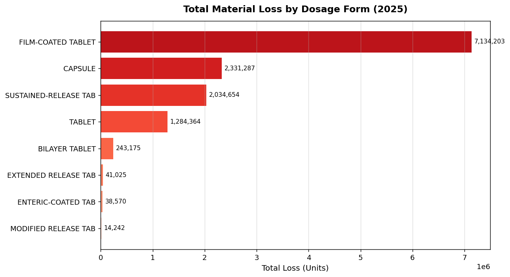

**Observation:** Film-Coated Tablet dominates with 7,134,203 units lost — more than 3x the next highest dosage form. Capsule (2,331,287) and Sustained-Release Tablet (2,034,654) are distant second and third. Tablet accounts for 1,284,364 units. The four specialty dosage forms (Bilayer, ER, EC, MR) contribute comparatively minor absolute losses.

**Insight:** Film-Coated Tablet's 7.1M unit loss is a direct consequence of its dominance in production volume — it represents 51.2% of total output. The more actionable signal is the loss rate (loss as a % of output per dosage form), which must be calculated to identify which dosage forms have disproportionate loss relative to their volume.

**Recommendation:** Calculate and track loss rate (loss units / total output units × 100) as a supplementary KPI alongside absolute loss. For Film-Coated Tablets, even a minor yield improvement represents millions of units recovered given the scale.

---

### Q3: Which generics have the highest total material loss?

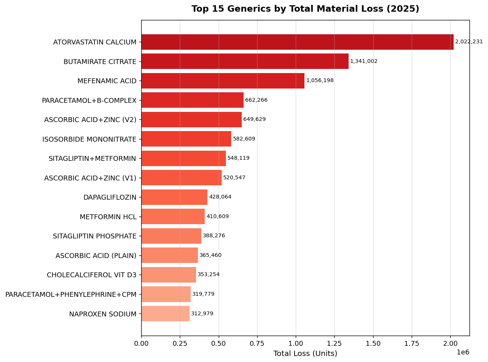

**Observation:** Atorvastatin Calcium leads by a significant margin at 2,022,231 units lost, followed by Butamirate Citrate at 1,341,002 and Mefenamic Acid at 1,056,198. These three generics collectively account for approximately 4.4 million units — roughly 34% of the total 13.1M unit facility-wide loss.

**Insight:** Mefenamic Acid's position at #3 in total loss is more alarming than Atorvastatin Calcium's #1 position, because it was also identified as an At Risk product in Module 2's yield underperformance analysis (58.54% of batches below 96% yield). This means Mefenamic Acid has both a high loss rate and high volume — a compounding risk. Atorvastatin Calcium's loss is partly explained by volume; Mefenamic Acid's is driven by a structural yield deficiency.

**Recommendation:** Mefenamic Acid should be designated for an immediate process improvement project. A targeted improvement to bring it above the 96% threshold consistently would recover approximately 500,000–700,000 units per year.

---

### Q4: What is the monthly trend of material loss?

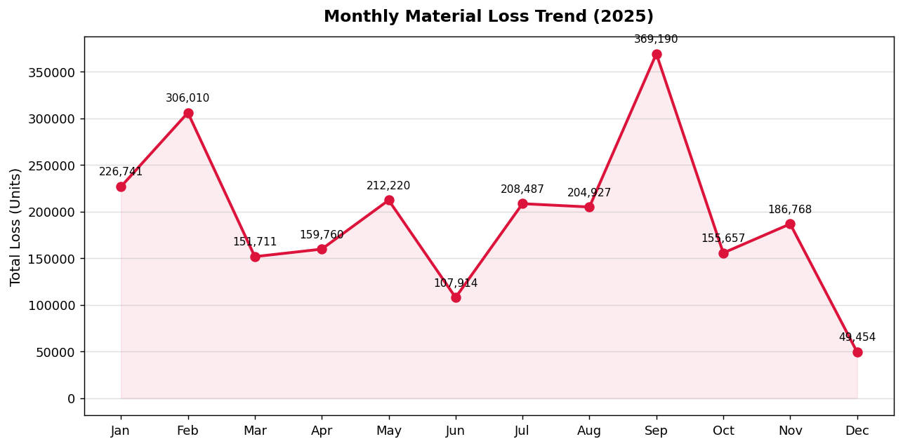

**Observation:** September is the peak loss month at 369,190 units. February is the second highest at 306,010 units. June is the lowest at 107,914 units, followed by December at 49,454 units.

**Insight:** The September peak directly aligns with the Q3 production peak — August had the highest batch count (120 batches) and September processed the results of that surge. The February peak similarly aligns with high batch output (108 batches). Loss is largely a function of volume: more batches in = more absolute loss out.

**Recommendation:** Calculate a monthly loss rate (loss/output) to distinguish months where loss is proportionally worse versus months where loss is high simply because of high volume. If loss rate spikes in specific months independent of volume, it points to a time-bound factor such as seasonal humidity, operator fatigue, or rushed scheduling.

---

## Module 7 — Market Demand Inference

### Q1: What is the seasonal production pattern by dosage form?

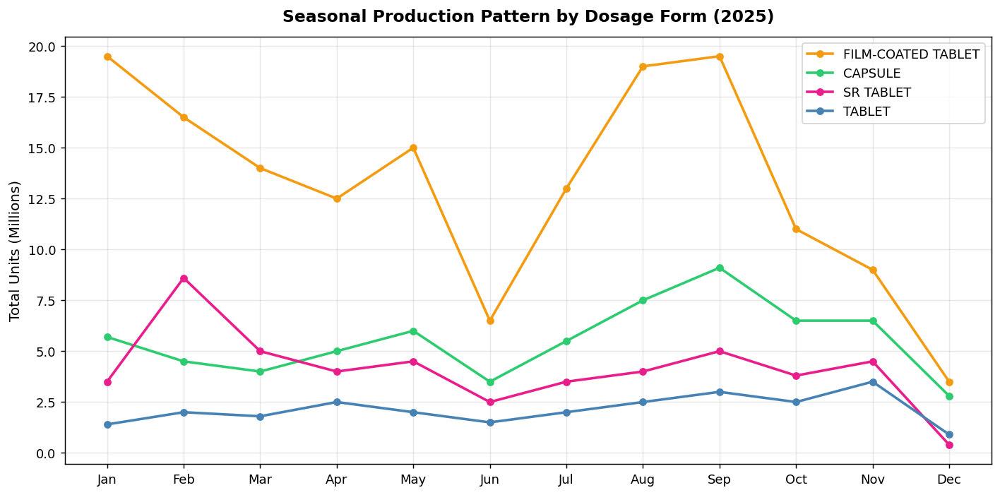

**Observation:** Film-Coated Tablet is the dominant dosage form throughout the year, with two pronounced peaks — January (19.5M units) and September (19.5M units) — and a notable trough in June (6.5M units). Capsule follows a similar two-peak pattern, surging in September (9.1M units) after a June low. Sustained-Release Tablet peaks sharply in February (8.6M units) before declining through mid-year. Tablet production is relatively flat throughout the year.

**Insight:** The dual-peak structure (January/February and August/September) across the two highest-volume dosage forms suggests that market demand follows two main selling seasons: Q1 post-holiday restocking and Q3 rainy season driven by respiratory illness demand. The June trough is partially artificial (audit downtime), but underlying demand also softens mid-year.

**Recommendation:** Align production planning with these two demand peaks. Build Film-Coated Tablet and Capsule inventory buffer in April–May (pre-rainy season) and in November–December (pre-Q1 restocking). This reduces pressure during the peaks themselves, when machine utilization is already at its highest.

---

### Q2: Which generics are showing production growth across 2025?

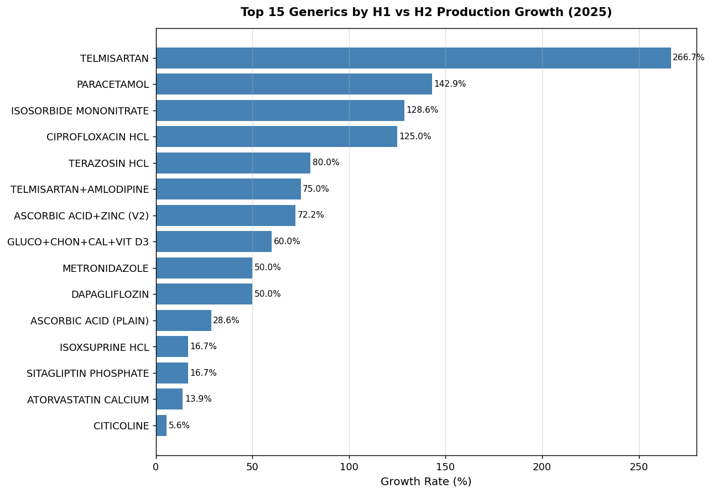

**Observation:** Telmisartan leads by a wide margin at 266.7% growth from H1 to H2 — meaning H2 production was nearly 3.7x higher than H1. Paracetamol (142.9%), Isosorbide Mononitrate (128.6%), and Ciprofloxacin HCL (125%) follow as the next fastest-growing generics. All 15 generics shown in the minimum-10-batch cohort recorded positive growth — none declined.

**Insight:** Telmisartan's 266.7% growth suggests either a new contract win or a late-year demand surge for hypertension management products — consistent with the broader cardiovascular therapy trend seen in Atorvastatin Calcium's high volume. The broad-based positive growth across all 15 generics implies facility-wide demand expansion, not isolated product movements.

**Recommendation:** Use H2 2025 growth as the baseline for 2026 production planning for the top-growth generics (Telmisartan, Paracetamol, Isosorbide Mononitrate, Ciprofloxacin HCL). Pre-position raw material procurement and packaging for these generics in Q1 2026 to avoid supply chain delays during peak production periods.

---

### Q3: What is the production concentration risk?

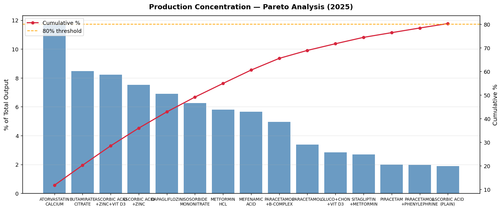

**Observation:** Atorvastatin Calcium alone accounts for 11.74% of total facility output — the single largest share of any generic. The top 5 generics (Atorvastatin Calcium, Butamirate Citrate, Ascorbic Acid + Zinc + Vitamin D3, Ascorbic Acid + Zinc, Dapagliflozin) collectively represent approximately 42.83% of total output. The top 10 generics account for roughly 65.49% of total output. The cumulative line approaches 80% around the top 15 generics — indicating that the facility's output is more evenly distributed than a classic Pareto (80/20) pattern.

**Insight:** The two Ascorbic Acid + Zinc variants (ranks #3 and #4) together account for ~15.73% of output — if these are in fact the same product recorded under different names, the combined concentration becomes the second largest dependency in the portfolio and represents a data integrity issue that inflates apparent diversification.

**Recommendations:**
1. Designate Atorvastatin Calcium as a Tier 1 critical product with priority in maintenance scheduling, machine qualification, and API safety stock management.
2. Resolve the dual Ascorbic Acid + Zinc naming inconsistency — if they are the same product, the combined ~15.73% share must be treated as a single concentration risk.
3. Set a concentration risk threshold (e.g., no single generic exceeding 15% of output) as a portfolio diversification guardrail for future production planning.

---

## Cross-Module Summary

| Area | Critical Finding | Module | Priority |
|---|---|---|---|
| Encapsulation yield | 40.8% of batches below target; masked by acceptable average | M5, M3 | **Critical** |
| Product yield | Multivitamins, Etoricoxib, Amlodipine+Valsartan FCT at 100% batch failure below 96% | M2 | **Critical** |
| Coating machine risk | KEVIN 48 handles 63% of coating — single point of failure | M3 | High |
| PHARMAFILL condition | Most-used encapsulation machine at 95.44% yield (94 batches); inverse frequency-yield | M3 | High |
| Lead time SLA | Levetiracetam at 27.1 days average — 6 days above 21-day SLA | M4 | High |
| Bilayer Tablet coating | 91.85% yield — worst dosage-stage combination in the facility | M5 | High |
| Q3 production surge | Aug–Sep peak drives scheduling congestion and lead time inflation | M1, M4 | High |
| Material loss — coating | 4.95M units lost in coating stage (38% of facility total) | M6 | High |
| Mefenamic Acid | High loss volume + At Risk yield = compounding risk | M2, M6 | High |
| Telmisartan demand | 266.7% H1→H2 growth; cardiovascular products expanding | M7 | Medium |
| Concentration risk | Top 5 generics = 43% of output; Atorvastatin at 11.74% | M7 | Medium |
| Naming inconsistency | Two Ascorbic Acid + Zinc variants may be the same product | M2, M7 | Medium |

---

*Generated from EDA modules 1–7 | Data source: lli_db (PostgreSQL star schema) | Batch records: 1,064 job orders | Fact rows: 5,320 | Analysis period: January–December 2025 | Generated: April 2026*
